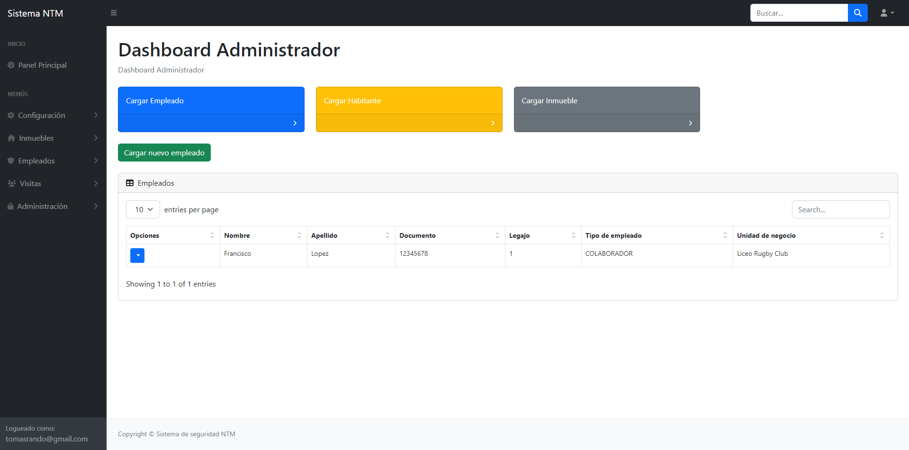
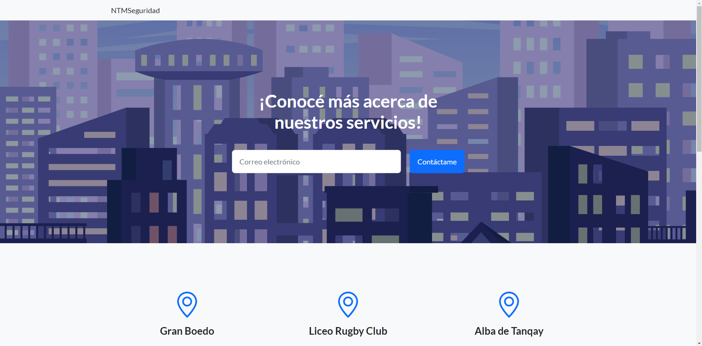

## Proyecto 2 - Ingeniería del Software II 2024

El proyecto consistió en un sistema de gestión de seguridad para barrios privados. Para la elaboración del mismo, se realizaron 3 subproyectos que se comunicaban entre sí. Estos fueron:  

- **Aplicación API Rest:** Desarrollada con Spring Boot
- **Cliente administrativo:** Aplicación desarrollada con Spring Boot que se comunica con la aplicación API Rest.
- **Página web pública:** Sitio que se actualiza dinámicamente utilizando la información recibida desde la API Rest.  

Para el desarrollo de estos proyectos se utilizaron diferentes herramientas, entre ellas:  

- Spring Boot
- Spring Security
- Lombok
- Thymeleaf
- Bootstrap
- MySQL
- JWT
- Postman
- Docker  
- Hibernate Envers

   
Entre otras tecnologías. Posteriormente, para la presentación del proyecto, se hizo el deploy del mismo en un servidor cloud utilizando Docker y adicionalmente, se agregó un dominio personalizado junto a un certificado SSL.

##### Integrantes del equipo:
- Tomás Rando  
- Ignacio Coppede  
- Mauro Sorbello  

##### Imágenes del proyecto:  

